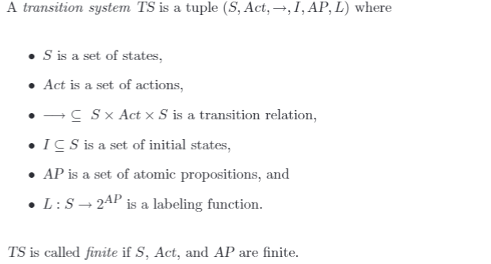

# Chapter 2 
background-color:: #793e3e
Modelling Concurrent Systems
- **2.1   Transition Systems**
  hl-page:: 38
  ls-type:: annotation
  background-color:: #787f97
  id:: 61890853-581f-4d6e-9128-65810ecba22b
	- **Definition 2.1.   Transition System (TS)**
	  hl-page:: 39
	  ls-type:: annotation
	  id:: 617ca6b5-f67f-4cb1-a7bd-41d77ca83ab2
		- {:height 231, :width 446}
		-
		- **AP** 是一个比较难理解的点，值的设置具有主观性；
	-
	- **Definition 2.3.   Direct Predecessors and Successors**
	  hl-page:: 42
	  ls-type:: annotation
	  id:: 61890cbd-c833-42db-b75c-98986cce17b0
		- 也就是图里的直接前驱和后继
		- 整个 TS 图确实可以看作一个转移图
	- **Example 2.11.    A Simple Sequential Hardware Circuit**
	  hl-page:: 45
	  ls-type:: annotation
	  id:: 6189112c-ce79-4cb4-a0aa-ee41a949bea8
		- 复习的时候看看吧
	- **Example 2.12.    Beverage Vending Machine Revisited**
	  hl-page:: 48
	  ls-type:: annotation
	  id:: 618911f4-3422-4950-9c33-d012c178b4c9
		- 加了条件的 TS 图
		- 中间的线条上标注转移条件 $$g : \alpha$$，$$g$$ 成立则执行 $\alpha$
		-
		-
# Chapter 3
background-color:: #793e3e
Linear-Time Properties-**_This chapter focuses onlinear-time behavior and establishes relations between the different classes of propertiesand trace behavior._**
- **3.1   Deadlock**
  ls-type:: annotation
  hl-page:: 108
  id:: 61893d81-f1df-42ac-8e0f-cf5a44c826e8
  background-color:: #787f97
	- A deadlock oc-curs if the complete system is in a terminal state, although at least one component is in a(local) nonterminal state.
	  hl-page:: 108
	  ls-type:: annotation
	  id:: 61893ed9-82ff-41c1-87e4-2cb21c58fa56
	- 系统停止，但仍有元素没有到达终止状态
	- **Example 3.1.    Deadlock for Fault Designed Traffic Lights**
	  hl-page:: 109
	  ls-type:: annotation
	  id:: 61893fa7-0cf9-422f-9802-647a770107d2
		- 由初始状态所导致的死锁
	- **==Example 3.2.    Dining Philosophers==**
	  hl-page:: 109
	  ls-type:: annotation
	  id:: 61894077-ce79-409c-b35d-0c988c9283c4
		- what individual starvation means?
		-