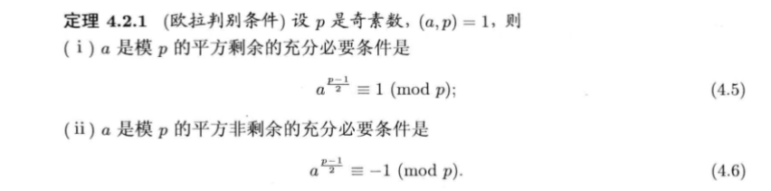

file:: [信息安全数学基础.pdf](file://D:\Application\ZoteroBeta\data/storage/WBPFHB6Q/信息安全数学基础.pdf)
file-path:: file://D:\Application\ZoteroBeta\data/storage/WBPFHB6Q/信息安全数学基础.pdf
collapsed:: true

- **往年考点**
  collapsed:: true
	- 辗转相除法求 $s,t$；
	- 中国剩余定理；
	- 解同余方程（一次，二次）；
	- 解原根；
- # Chapter 1
  background-color:: #793e3e
- **定理 1.1.9 (欧几里得除法)**
  hl-page:: 18
  ls-type:: annotation
  id:: 617bcbe9-05d3-4464-b2da-69d822bbe6a8
  collapsed:: true
	- 这应该是贯穿第一章的最重要的定理，衔接了辗转相除法；
-
- **素数的平凡判别**
  hl-page:: 19
  ls-type:: annotation
  id:: 617bccaa-baf5-4abc-886e-fdb7725a288c
  collapsed:: true
	- 是判定某个数是不是素数，其复杂度是相对于这个数 $n$ 来的，为 $\sqrt{n}$，而素数筛法是判断小于 $n$ 的所有素数，厄拉托塞（Eratoshenes）方法的上界是 $n^2$，但实际复杂度远小于此；
	  collapsed:: true
	  
	  可以百度一下；
	-
- [:span]
  ls-type:: annotation
  hl-page:: 36
  id:: 618247bf-2532-4d12-9715-742011cd3e2c
  hl-type:: area
  hl-stamp:: 1635927993830
  collapsed:: true
	- 首先正负不改变最大公因数；
	- 其次用辗转相除法得结果；
-
- [:span]
  ls-type:: annotation
  hl-page:: 37
  id:: 61824976-bd84-4723-8d5d-e8e9cac365d5
  hl-type:: area
  hl-stamp:: 1635928436994
  collapsed:: true
	- 这个时候要注意正负值；（其实也不用，最后改一下该元素前面的正负号即可）；
	-
- **1.3.6 多个整数的最大公因数及计算**
  hl-page:: 48
  ls-type:: annotation
  id:: 61824be3-8924-4ab8-b715-59ab83eaafd0
  collapsed:: true
	- 用递归的方法，将求它们的最大公因数转化为一系列求两个整数的最大公因数；则它们的公因数即为最后那个数；
	- 用素数分解的方法；
	-
- **1.4.4 多个整数的最小公倍数**
  hl-page:: 52
  ls-type:: annotation
  id:: 61824d62-71ad-47c1-b4ce-a170f4ff3d1c
  collapsed:: true
	- 同样用递归的方法计算，而求最小公倍数需要先求最大公因数；
	- 用素数分解的方法；
	-
- **1.8习题**
  hl-page:: 60
  ls-type:: annotation
  id:: 61825cdd-ab89-4974-b279-2cc2a0f16394
-
  collapsed:: true
  ---
# Chapter 2
background-color:: #793e3e
- **定义2.2.1 剩余类和完全剩余系**
  hl-page:: 75
  ls-type:: annotation
  id:: 618275b9-4611-420d-8949-fd0478b8efe8
  collapsed:: true
	- 剩余类只是一个类，所有包含的剩余类构成了一个完全剩余系；
	- 有了互素的限制之后就转化为 **简化剩余类** 和 **简化剩余系**；
	-
- **定理2.3.7 设m,n是互素的两个正整数，则**
  hl-page:: 85
  ls-type:: annotation
  id:: 61827b05-323f-48d7-8368-861dcf5d15cf
  collapsed:: true
  $$\varphi(m\cdot n) = \varphi(m) \cdot \varphi(n)$$
	- 注意，互素才能相乘；
-
- [:span]
  hl-type:: area
  hl-stamp:: 1635942355132
  hl-page:: 86
  ls-type:: annotation
  id:: 61827fd4-5444-4b66-9c3e-03949d59107c
- **定理2.4.1 Euler 定理**
  hl-page:: 89
  ls-type:: annotation
  id:: 61828074-2b1a-454e-982d-c5188fc613a2
- **定理2.4.2 Fermat 小定理**
  hl-page:: 90
  ls-type:: annotation
  id:: 61828110-7ed2-41aa-9008-41f145b41520
- **定理2.4.3 Wilson 定理**
  hl-page:: 91
  ls-type:: annotation
  id:: 61828142-92ca-4a02-8e35-4612b0b9e0e3
-
- **2.6 习题**
  hl-page:: 100
  ls-type:: annotation
  id:: 61828365-6260-439c-a380-b3911e30c689
-
  collapsed:: true
  ---
# Chapter 3
background-color:: #793e3e
- 例3.1.2 求解一次同余式
  hl-page:: 106
  ls-type:: annotation
  id:: 61828627-48b9-476d-a6a0-667c590843b4
  collapsed:: true
  $$33 x = 22 (\bmod\ 77)$$
- **3.2 中国剩余定理**
  hl-page:: 107
  ls-type:: annotation
  id:: 618286da-4e24-4af0-b487-823efc5b3d17
  collapsed:: true
	- [中国剩余定理（CRT ） - Bat特白的文章 - 知乎](https://zhuanlan.zhihu.com/p/44591114)
	- 解二
	  ls-type:: annotation
	  hl-page:: 116
	  id:: 6182944a-d5e2-4b18-9cd7-5bc5632ba862
	  collapsed:: true
		- 用中国剩余定理解超高次幂的同余值；
-
- **例 3.3.1 同余式拆分为同余式组**
  hl-page:: 122
  ls-type:: annotation
  id:: 618298c5-8963-41a5-9be5-269bcb63f300
  collapsed:: true
	- 同余式拆分后有多个解，满足的都要写上；
	-
- **素数模的同余式的简化**
  hl-page:: 128
  ls-type:: annotation
  id:: 6182a10b-915b-46ea-b47f-f961a504f70e
  collapsed:: true
	- 做多项式的化简
	- $f(x) = q(x)(x^p - x) + r(x)$ 则可以把 $f(x)$ 降到 $r(x)$
	- **例3.4.1**
	  hl-page:: 128
	  ls-type:: annotation
	  id:: 6182a27e-835a-4acc-a4bb-f2877d153db4
-
  collapsed:: true
  ---
# Chapter 4
background-color:: #793e3e
- **例 4.1.9**
  hl-page:: 139
  ls-type:: annotation
  id:: 6182a871-01d1-4ce5-be4c-455fcf1c3b79
  collapsed:: true
	- 二次同余式用中国剩余定理分解后，也是有很多种组合；
	- 拆解的时候要拆成两两互素；
- **欧拉判别条件**
  hl-page:: 141
  ls-type:: annotation
  id:: 6182aba7-ee21-4ca7-98ef-ccb33b7517ce
  collapsed:: true
	- 
	- 判别的模数是**奇素数**，但是 2 的情况很简单；
	-
- **推论**
  ls-type:: annotation
  hl-page:: 142
  id:: 6182aca0-ae53-44d3-9b68-6d0f35c4f942
  collapsed:: true
	- 平方剩余的判定相当于 正负得负，负负得正；
	-
- **例 4.3.1**
  hl-page:: 145
  ls-type:: annotation
  id:: 6182adef-5b32-4222-a070-f4ac3f01bfad
  collapsed:: true
	- ==对于大模数的第一想法都是分解；==
	- 而且当前所有的判定条件都是基于奇素数（后面的雅可比符号 ((6182b63f-a799-41ea-8c8b-1e34aa86ae03)) 可以用于任何数）
	-
- **定理 4.3.4**
  hl-page:: 147
  ls-type:: annotation
  id:: 6182aefa-d673-4684-912f-f7b02b6d8fc4
  collapsed:: true
	- 对于 2 的简单判定方法；
	-
- **定理4.4.1 (二次互反律)**
  hl-page:: 149
  ls-type:: annotation
  id:: 6182b3a2-2829-4421-a6de-a4b24531c224
  collapsed:: true
	- 注意是两个奇素数之间的辗转
	- 而合数可以拆分成两个的乘积
	-
- **4.5 雅可比符号**
  hl-page:: 155
  ls-type:: annotation
  id:: 6182b63f-a799-41ea-8c8b-1e34aa86ae03
  collapsed:: true
	- 只能判断其为二次非剩余
	-
- **4.6.1 模p平方根**
  hl-page:: 158
  ls-type:: annotation
  id:: 6182b752-5a26-43e5-a1fc-91dcbe3817ce
  collapsed:: true
	- 直接找出根；
	- $x = +/- a^{\frac{p+1}{4} (\bmod \ p)} \quad p = 4k + 3$
	-
-
  collapsed:: true
  ---
# Chapter 5
background-color:: #793e3e
- 指数
  ls-type:: annotation
  hl-page:: 178
  id:: 6182b8df-24fb-4934-905f-a9583cbf7b10
- 定理5.1.5 设 $m>1$ 是整数.如果模 $m$ 存在一个原根 $g$,则模 $m$ 有 $\varphi(\varphi(m))$ 个不同的原根.
  hl-page:: 184
  ls-type:: annotation
  id:: 6185fa41-eb40-4e59-96cb-c0b0344b0bd5
  collapsed:: true
	- 这个定理其实给出了所有原根的遍历方法
	-
-
- [:span]
  ls-type:: annotation
  hl-page:: 188
  id:: 6185fd90-17a9-46b0-aa5e-95c269822aac
  hl-type:: area
  hl-stamp:: 1636171150698
  collapsed:: true
	- 记住结论即可
- **定义 5.1.2**
  hl-page:: 189
  ls-type:: annotation
  id:: 6185fdd3-752f-4145-b965-4b512317e3d8
  collapsed:: true
	- 对于一个剩余系而言，阶数都是满足所有元素的那个最小值
-
- [:span]
  ls-type:: annotation
  hl-page:: 191
  id:: 61860037-cbca-4bac-b9ec-14cab28caabb
  hl-type:: area
  hl-stamp:: 1636171889942
  collapsed:: true
	- 阶数只能是 $\varphi(p)$ 的因数
- 在 $m=p^a$ 或 $2p^a$ 的情形下，模 $m$ 的原根 $g$ 是存在的.
  hl-page:: 203
  ls-type:: annotation
  id:: 618601f2-95b2-4aa9-8686-ccbbc315933a
- [:span]**指标的定义**
  hl-type:: area
  hl-stamp:: 1636172841890
  hl-page:: 203
  ls-type:: annotation
  id:: 6186042c-cd82-411e-862e-1726ccf70f79
- ==**例5.3.4 通过指标来简化求 n 次同余**==
  hl-page:: 205
  ls-type:: annotation
  id:: 618604bb-4676-42b3-997a-7a314f9db18f
- [:span]
  ls-type:: annotation
  hl-page:: 206
  id:: 6186393a-5f66-4b6d-96be-f5288938fb34
  hl-type:: area
  hl-stamp:: 1636186428871
  collapsed:: true
	- 这个推论给出了判断 n 次剩余存在的充要条件
-
  collapsed:: true
  ---
# Chapter 6
background-color:: #793e3e
collapsed:: true
	- 在本章，研究如何产生以及如何快速产生大素数，特别是利用对于素数成立的定理(Fer­mat小定理、欧拉定理等)的否定说法来产生大素数.
	  ls-type:: annotation
	  hl-page:: 210
	  id:: 61863a4d-d59e-49ad-9983-ce715efd4a19
-
- [:span]
  ls-type:: annotation
  hl-page:: 210
  id:: 61863b25-2f45-472b-927a-f9f8c4eae41c
  hl-type:: area
  hl-stamp:: 1636186915915
  collapsed:: true
	- 费马小定理的逆否命题，用来判定某个数是合数；
- **费马伪素数的定义**
  collapsed:: true
	- [:span]
	  hl-type:: area
	  hl-stamp:: 1636187321168
	  hl-page:: 211
	  ls-type:: annotation
	  id:: 61863cba-038c-4c14-bad8-8da0a542b1db
	- 注意：定义里的 n 是合数，也就是说，满足这种形式的合数叫做伪素数；
- **==例 6.1.4== 伪素数例题**
  hl-page:: 211
  ls-type:: annotation
  id:: 6186419b-1cc9-4439-a548-edac28b3d158
- **Fermat 素性检验**
  hl-page:: 213
  ls-type:: annotation
  id:: 618643cf-5520-4f08-bc9d-1a5148083442
- **==定义 6.1.2== Carmicheal 数**
  hl-page:: 215
  ls-type:: annotation
  id:: 61887f00-146d-44fc-8fd5-ec6c24f705b0
- **6.2.1 Euler 伪素数**
  hl-page:: 216
  ls-type:: annotation
  id:: 618883a1-ce3f-4ed8-a1bc-a68f7f1ebb2f
  collapsed:: true
	- 用勒让德符号来判别
	- 检验对象依然是合数，而且是正奇合数
- **6.3.1 强伪素数**
  hl-page:: 221
  ls-type:: annotation
  id:: 61888c8f-0580-4e39-8068-abb595a64370
  collapsed:: true
	- **定义 6.3.1**
	  hl-page:: 221
	  ls-type:: annotation
	  id:: 61890246-0f86-457d-b4a8-c71087a9668c
-
  collapsed:: true
  ---
- # Chapter 8
  background-color:: #793e3e
  collapsed:: true
  群 - **_本章及以后章节，主要介绍具有运算的集合所具有的数学理论和方法，即代数理论和方法，主要是群、环、域及Galois理论等._**
- **8.1 群**
  hl-page:: 244
  ls-type:: annotation
  id:: 618b37e9-b925-4de0-81f2-1a4ddf0685eb
  background-color:: #787f97
  collapsed:: true
	- **==定义 8.1.3==： 群的定义**
	  hl-page:: 245
	  ls-type:: annotation
	  id:: 618b3899-c18c-4403-9342-92d63ab4c690
	  collapsed:: true
		- 运算的封闭性
		- 结合律
		- 单位元
		- 逆元
	- **==定理 8.1.1==：群的简易判别**
	  hl-page:: 252
	  ls-type:: annotation
	  id:: 618b6340-bd9e-4329-bd99-429cd4f5c051
	  collapsed:: true
		- $ax = b, ya = b$ 有解
	- **==定义 8.1.4==：子群的定义**
	  hl-page:: 253
	  ls-type:: annotation
	  id:: 618cf930-8c88-49aa-8f92-7c73dd864e36
	- **定理 8.1.2：子群的简易判别**
	  hl-page:: 253
	  ls-type:: annotation
	  id:: 618cfccf-a128-48da-8e7a-1088bbf1d0d9
	- **定义 8.1.5：生成子群 <X>**
	  hl-page:: 253
	  ls-type:: annotation
	  id:: 618cfe86-9957-4f1d-b80d-78e2fb482cb6
		- 按定义，是包含 **集合 X** 的最小子群，也就是由 **集合 X** 生成的子群
		- 若集合 X 只包含一个元素，则生成的群称为**循环群**
		-
	- **定理 8.1.4：给出了生成子群的通用形式**
	  hl-page:: 254
	  ls-type:: annotation
	  id:: 618d000b-124f-4856-8bc6-2cdc1f1aac6d
	- **==总结==**：这一小节从定义交换法开始，也就是定义了一个封闭运算，为什么叫交换，可能只是元素的排列组合，就和置换一样；接着在满足交换法的集合上，确定单位元和逆元，这样就成为了一个群；接着对子集合，在同样满足封闭性，单位元和逆元的情况下，将其称为子群；
- **8.2 正规子群和商群**
  hl-page:: 255
  ls-type:: annotation
  id:: 618d054e-4996-4fcd-b049-61b2506d2d0c
  background-color:: #787f97
  collapsed:: true
	- **定义 8.2.1：陪集的定义（左右陪集）**
	  hl-page:: 255
	  ls-type:: annotation
	  id:: 618d05a3-874c-447c-a008-b6d6ea641e11
	- **定理8.2.1：两个陪集之间关系的性质（何时两个陪集相等，何时交集为空）**
	  hl-page:: 255
	  ls-type:: annotation
	  id:: 618d0893-5081-4806-b684-b3e9aff64fea
	  collapsed:: true
		- 要回顾这些性质最后用在了什么地方
		- **==两个陪集，要么相等，要么不相交，也就是说陪集给出了一个群的分类==**
	- **==定义8.2.2==：商集 --- 所有陪集的集合构成了商集**
	  hl-page:: 256
	  ls-type:: annotation
	  id:: 618d0936-eeab-471f-a01e-97a87d4f625d
	- **==定理 8.2.2==：陪集的阶数与原群集阶数的关系（因数与倍数的关系）**
	  hl-page:: 256
	  ls-type:: annotation
	  id:: 618d09fc-172d-4b76-bf7d-21e08f878514
	  collapsed:: true
		- ==推论(Lagrange) 设H是**有限群**G的子群，则子群H阶是|G|的因数.==
		  hl-page:: 257
		  ls-type:: annotation
		  id:: 618d0e42-a79a-4955-a7ff-dbaed70d4cf0
	- **定义 8.2.3：正规子群，也就是左右陪集相等，也即满足局部的交换性**
	  hl-page:: 260
	  ls-type:: annotation
	  id:: 618d1fe9-05b6-4ee5-9513-215a4c026db4
	  collapsed:: true
		- 当所选子群为正规子群后，商集也就构成了商群（在特定运算下），而一般商集在子群上满足不了交换律，所以得不到在 $(aN)(bN) = (ab)N$ 这种运算下的群
		  hl-page:: 260
		  ls-type:: annotation
		  id:: 618d20be-ad71-4969-9085-5eaf0432117d
- **8.3 同态和同构**
  hl-page:: 260
  ls-type:: annotation
  id:: 618d2235-23fc-413e-b103-90fe931540c8
  background-color:: #787f97
  collapsed:: true
	- **==这一节笔记在书上==**
	- 定义8.3.1 同态
	  ls-type:: annotation
	  hl-page:: 260
	  id:: 618f1f4d-9941-4c44-b3e3-8c350d5bbf76
	- 定义8.3.2 同构
	  hl-page:: 261
	  ls-type:: annotation
	  id:: 618f1f52-7ddf-451c-82a6-c9a1a7915ae8
-
  collapsed:: true
    ---
- # Chapter 9
  background-color:: #793e3e
- **9.1 循环群**
  hl-page:: 267
  ls-type:: annotation
  background-color:: #787f97
  id:: 619d9012-8ff4-40c3-ac1b-5f160d6dca29
	- **定理 9.1.2：构造加群到任意循环群的同构**
	  hl-page:: 267
	  ls-type:: annotation
	  id:: 619d9054-1305-4821-9c6d-fa457f1d0756
	  collapsed:: true
		- 这也就意味着任意未知的循环群都可以转换到整数加群上去研究
	- **引理 9.1.1：==交换群==乘积阶数的关系（注意一定要是交换群）**
	  hl-page:: 269
	  ls-type:: annotation
	  id:: 619d96c0-82a1-4f06-8717-fa32133939e5
	  collapsed:: true
		- $ord(a*b) = ord(a) * ord(b)$
	- **引理 9.1.2：存在元素阶数为最小公倍数**==（学习构造方法）==
	  hl-page:: 269
	  ls-type:: annotation
	  id:: 619d988e-b529-41c3-b8e5-5ea11ba8de13
	  collapsed:: true
		- $\exist c, ord(c) = [ord(a), ord(b)]$
		- 构造方法要记住
	- 例 9.1.1
	  collapsed:: true
		- 所以G中元素的阶都是12的因子（是卡迈克尔函数性质）
		  hl-page:: 270
		  ls-type:: annotation
		  id:: 619d9caa-4d54-4680-bb48-80096cb193b4
- **9.2 有限生成交换群**
  hl-page:: 271
  ls-type:: annotation
  id:: 619f71f8-3d34-444c-b72f-c6124cd3f47e
  background-color:: #787f97
	- **乘性无关**：也就是乘法线性无关，只不过将运算改成了乘法，单位元改成了 e
	  hl-page:: 271
	  ls-type:: annotation
	  id:: 619f6f34-b2af-4f20-9660-d6c17f8c9d93
	- **==直积==**
	  hl-page:: 272
	  ls-type:: annotation
	  id:: 619f7143-aa11-4ecd-813e-a9d14738d4b8
		- ==**直和**==
		  hl-page:: 272
		  ls-type:: annotation
		  id:: 619f7149-2d95-4981-a242-c945c424fb67
		- 其实也就是正交性
	- **定理 9.2.1：自由交换群**
	  hl-page:: 272
	  ls-type:: annotation
	  id:: 619f72a7-f6af-4307-926b-e1db49b5cfdf
		- 这里阐述的就是说，基底能通过直和或直积的形式张成整个空间
	- 自由交换群 a 的基底的元素个数叫做群 G 的秩.**（代数通用思路：有了基底也就会有秩的概念）**
	  hl-page:: 272
	  ls-type:: annotation
	  id:: 619f748a-ee56-4b01-86ae-f61aa4fa0b0c